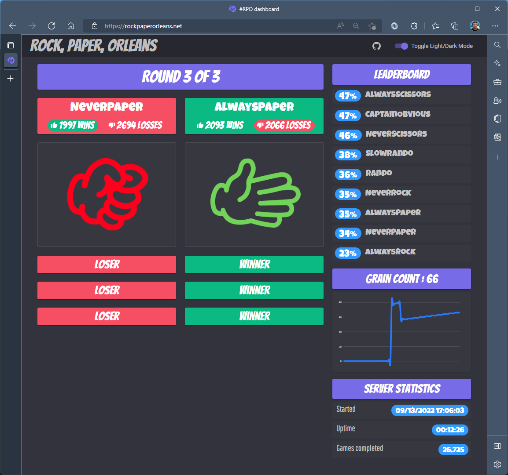

# Rock, Paper, Orleans

Rock, Paper, Orleans (RPO) is a game built using dotnet, .NET Aspire, and Orleans. The idea behind RPO is that you write a "player bot" in which you implement your player logic. The game engine essentially runs forever as a dotnet Worker service (which we may tweak later to run as an Orleans timer). Players wait in a lobby, and are matchmade each round randomly. The game is played, the winner and loser recorded, and the next game started. 


## Prerequisites

To get this project up and running on your own machine and in your own Azure subscription, you'll need to install [.NET Aspire](https://learn.microsoft.com/dotnet/aspire/fundamentals/setup-tooling). If you want to deploy the app to Azure Container Apps, you'll need an Azure subscription, too. 


## Getting Started

Here's what RPO looks like when you have it up and running. In this screenshot, we're using the dark theme, and we have all the default players (at the time of v1's release) running in the app. 




The game topology consists of a series of Visual Studio projects you'll find in the `src` folder. Here's a breakout of these projects so you understand what's what. 

| Project          | Purpose                                                      |
| ---------------- | ------------------------------------------------------------ |
| GameController   | The dotnet worker service project that hosts the game engine, or the "game loop". This project's front door is the Orleans Dashboard, as this is the one silo in the solution that hosts Grains. |
| Leaderboard      | This is the front-end UI of the app.                         |
| Players          | Hosts the more basic players in the app.                     |
| Rando            | Hosts the "random" player and the "slow random" player, which emulates a player taking a longer period of time to perform their move. Also contains the Captain Obvious player, which demonstrates implementing a simple logic flow in a player's implementation. |
| .Abstractions    | This project contains the various Grain interfaces or abstractions, as well as any models (the "nouns" in the system as well as the behavioral abstractions) are contained here. |
| .Grains          | Implementations of the Grain interfaces.                     |
| RockPaperOrleans | Infrastructure and convenience classes that simplify the programming model of building and hosting players. |
| AppHost          | The .NET Aspire orchestration or App Host project. |
| Defaults          | The .NET Aspire defaults project most of the other projects reference. |

## Running the app

Whether you run the app using Visual Studio, VS Code, or the command line, just run the App Host project. 

## Deploying the app

We used AZD to make this process easier. You'll find that we adhered to the AZD-friendly layout for the `infra` parts, where our Bicep files and ARM parameter files are located. This makes deployment as simple as:

1. `azd init` - allow `azd` to infer what it should do based on `azd`'s integration with `dotnet run` for Aspire projects. 
2. `azd up` to create the supporting Azure resources and deploy the app. 

## Writing a player

To write a player, you create a new class that inherits from `BasePlayerGrain`. You can override any of the methods, but you're only required to implement the `Go()` method. `Go` is where all the logic for your player is stored. 

Let's walk through some of the players we shipped with v1 of RPO give you an overview of how to write a player bot, and then later, how to host it (don't worry, it's simple). 

### Players Examples

In the `Players` project, there are a series of very-basic players that behave in very-obvious ways. 

```csharp
public class AlwaysPaper : BasePlayerGrain
{
    public override Task<Play> Go(Player opponent) => Task.FromResult(Play.Paper);
}

public class AlwaysRock : BasePlayerGrain
{
    public override Task<Play> Go(Player opponent) => Task.FromResult(Play.Rock);
}

public class AlwaysScissors : BasePlayerGrain
{
    public override Task<Play> Go(Player opponent) => Task.FromResult(Play.Scissors);
}
```


### Rando Examples

The `Rando` project contains, obviously, the `Rando` player, which, probably-also-obviously, throws random moves. 

> One day we'll implement logic to control a bot that just stops or is too slow, but for now we'll control that using code reviews.

The code for `Rando` is, again, probably pretty obvious in nature. 

```csharp
public class Rando : BasePlayerGrain
{
    public override Task<Play> Go(Player opponent) => Task.FromResult((Play)Random.Shared.Next(0, 3));
}
```


### Mr. Presumptive

`MrPresumptive` bases his move off the name of the player, or more generally, a component of the name of the player using very-very-basic pattern matching. 

```csharp
public class MrPresumptive : BasePlayerGrain
{
    public override Task<Play> Go(Player opponent)
    {
        var result = opponent.Name switch
        {
            { } name when name.Contains("scissors", StringComparison.OrdinalIgnoreCase) => Play.Rock,
            { } name when name.Contains("rock", StringComparison.OrdinalIgnoreCase) => Play.Paper,
            { } name when name.Contains("paper", StringComparison.OrdinalIgnoreCase) => Play.Scissors,
            _ => (Play)Random.Shared.Next(0, 3)
        };

        return Task.FromResult(result);
    }
}
```


## Hosting a player

Both `Rando` and `Players` show examples of how to host multiple players in one Kestrel host. We've provided the extension method `AddRockPaperOrleans` you can use on the `WebApplicationBuilder` of your own host code, and the `AddPlayer<T>` method which takes any `BasePlayerGrain` inheritor. 

That means you can host multiple players, like our `Players` host:

```csharp
builder.AddRockPaperOrleans(siloBuilder => 
    siloBuilder.AddPlayer<AlwaysPaper>()
               .AddPlayer<AlwaysRock>()
               .AddPlayer<AlwaysScissors>());
```


### Logs

RPO has a ton of logs to aid with development-time and debugging. You'll want to update the `appsettings.json` to "turn down the log verbosity" to warning or lower once you're ready to deploy "for real" or you'll have a LOT of logs. 

## Your bot can do better!

We'd like you to write your own player, so feel free to send a pull request. When you do, please either add your player to the `Players` project, or write your own host. In addition, please add your own workflow in the `.github` folder, so we can deploy your player separately if you're hosting it on your own. 
